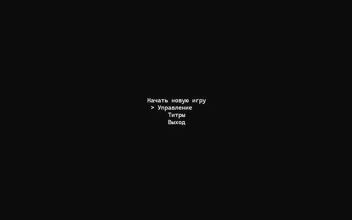
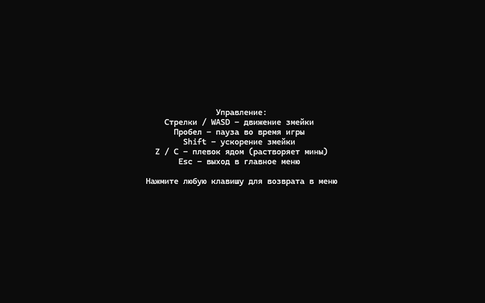
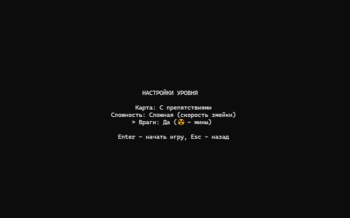
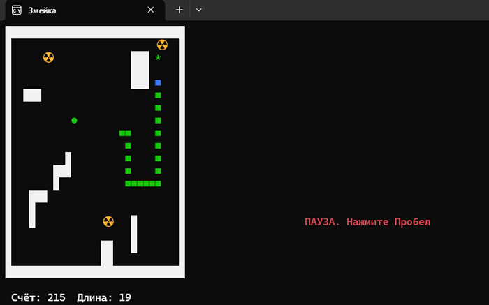

# 🐍 Змейка на C# с боевыми механиками

> Не совсем классическая «Змейка», в которой можно **собирать еду и расти**, **ускоряться** и **уворачиваться от препятствий**, **ломать мины "стреляя" кислотой**, **также реализована игровая пауза**, **выбор и рост сложности**. Игра написана на чистом C# с консольной графикой и демонстрирует понимание ООП, SOLID и паттернов проектирования.

## ✨ Особенности
- **Геймплей** – змейка растет, когда ест, должна уворачиваться от препятствий и мин, а также может "стрелять" кислотой.
- **Стрельба** – Можно выпустить снаряд (плевок кислотой), который уничтожает мины и не вредит змейке.
- **Ускорение** – Реализовано ускорение, чтобы временно двигаться быстрее.
- **Враги (мины)** – появляются и медленно движутся к змейке; столкновение отнимает все очки и укорачивает змею до минимума.
- **Разная еда** – каждая еда имеет свой цвет, символ, количество прибавляемых очков и время жизни, легко добавить новую еду в игру.
- **Генерация карт** – поддержка различных карт через интерфейс `IMap`, легко создать другие версии генераций.
- **Пауза** – Возможность паузы во время игры.
- **Конец игры** – с возвратом в главное меню.
- **Игровое меню** – привычное для всех меню управляемое на стрелки / `W A S D` и `Enter`, `Esc`. Титры, управление, выход из игры и новая игра с настройками сложности.

## 🛠 Технологии
- **Язык**: C# (.NET 10.0).
- **Среда выполнения**: Консоль Windows/Linux.
- **Архитектура**: Композиция объектов, интерфейсы, паттерн «Состояние» для игровых экранов.
- **Управление зависимостями**: Ручной DI через конструкторы.

## 💻 Установка и запуск
### Запуск без установки .NET
1. Скачайте последнюю версию игры со страницы [Releases](https://github.com/Pirogas3/CSharpSnakeProject/releases/tag/v1.0.0) (файл `SnakeGame.7z`, ~95 МБ).
2. Распакуйте архив и перейдите в папку в зависимости от вашей платформы (Win/Linux - x64).
3. Запустите `CSharpSnakeProject.exe` – игра не требует установки .NET.

### Запуск из исходников (для разработчиков)
1. Клонируйте репозиторий.
2. Откройте `CSharpSnakeProject.sln` или `CSharpSnakeProject.slnx` в Visual Studio.
3. Соберите и запустите.

## 🎮 Управление
- **Движение** – стрелки / `W A S D`.
- **Стрельба** – нажмите `Z` или `C` , чтобы выпустить снаряд (плевок кислотой), который уничтожает мины и не вредит змейке.
- **Ускорение** – удерживайте `Shift`, чтобы временно двигаться быстрее.
- **Пауза** – нажмите `Space` во время игры, чтобы поставить её на паузу.
- **Выход в меню** – нажмите `Esc` во время игры, чтобы выйти в главное меню.

## 📸 Скриншоты
| Главное меню | Управление |
|:---:|:---:|
|  |  |

| Настройки уровня | Геймплей |
|:---:|:---:|
|  |  |

## 🧱 Архитектура проекта
| Компонент | Ответственность |
|-----------|----------------|
| `GameWorld` | Центральный координатор: связывает менеджеры, правила и игровой цикл. Не содержит игровой логики, только делегирует. |
| `FoodManager` | Генерация еды, таймер жизни, выбор случайного типа еды из списка `IFood`. |
| `MineManager` | Управление врагами (минами): движение к змее, время жизни, поддержание количества в зависимости от счёта. |
| `ProjectileManager` | Снаряды (плевки кислотой): движение, столкновения со стенами, минами и телом змеи. |
| `MovementTimer` | Точный контроль интервала движения змеи, поддержка ускорения (Shift) с плавной коррекцией таймера. |
| `CollisionChecker` | Статический класс для унификации проверок (стены, тело змеи, мины, еда). Устраняет дублирование кода. |
| `IGameRules` | Инкапсулирует логику наказаний (столкновение с собой, стеной) и окончания игры. Позволяет легко менять правила. |
| `BaseGameState` + наследники | Паттерн «Состояние» для экранов: `MenuState`, `SnakeGameplayState`, `SettingsState` и т.д. |

- **Single Responsibility** – каждый класс делает только одно дело.
- **Open/Closed** – новую еду или врага можно добавить, не меняя существующие классы (достаточно реализовать интерфейс).
- **Dependency Inversion** – менеджеры зависят от абстракций (`IMap`, `IFood`, `IFoodGenerator`), а не от конкретных реализаций.
- **Тестируемость** – каждый компонент можно проверить отдельно

## 📫 Контакты
**Виктор**
- **GitHib:** https://github.com/Pirogas3
- **Telegram:** @victor_barber1444
